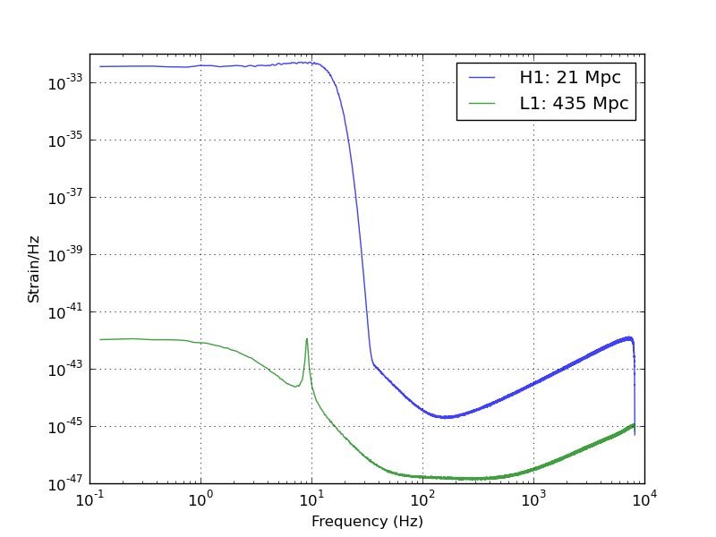
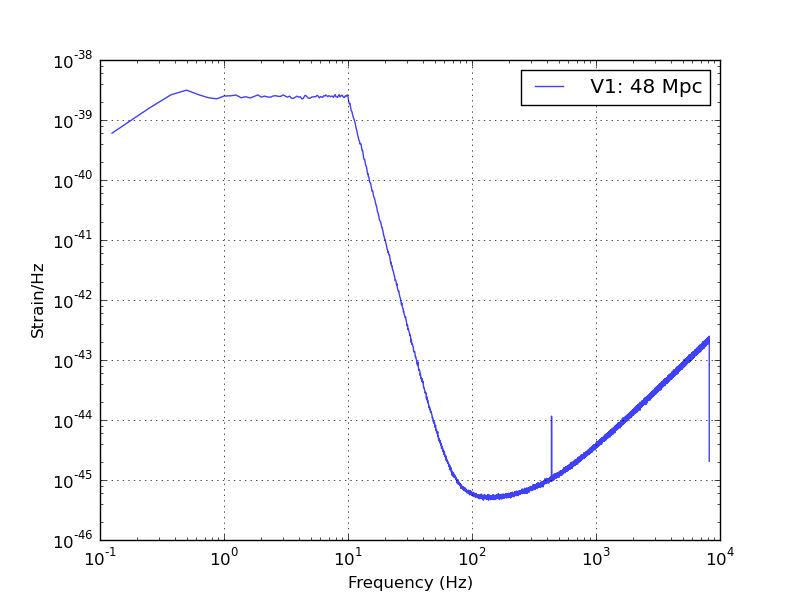

Documentation for creating fake data
====================================

Introduction
------------

GstLAL provides several tools for producing fake gravitational wave data for
the purpose of simulating various scenarios.  This page works through several
examples starting with simple command line data generation, working up to
Condor DAGs that can generate months of fake data suitable for MDC studies.

Basic LIGO/ALIGO colored Gaussian noise on the command line
-----------------------------------------------------------

Consult :any:`gstlal_fake_frames` for more details

The basic steps to generate and validate LIGO colored noise are:

 1. Use ``gstlal_fake_frames`` to make the data
 2. Verify that the PSD is as you would expect with ``gstlal_reference_psd``
 3. Plot the resulting PSD with ``gstlal_plot_psd``

An example PSD plot:

Custom colored noise, i.e. simulate your own detector
-----------------------------------------------------

Consult :any:`gstlal_fake_frames` for more details

 1. Start by obtaining a reference PSD that you wish to have as the target for recoloring. If you actually have a text file ASD such as this one: e.g. `here <https://git.ligo.org/lscsoft/gstlal/raw/master/gstlal/share/v1_early_asd.txt>`_, then you will need to first use ``gstlal_psd_xml_from_asd_txt`` to convert it
 2. Next use ``gstlal_fake_frames`` to make the data with the desired PSD
 3. Repeat the same validation steps as above to obtain, e.g.:
 

Recolored noise
---------------

Consult :any:`gstlal_fake_frames` for more details

This procedure assumes you are on an LDG cluster which has the data you wish to
recolor.  Note that some of the tools required on not gstlal based.  Please
consult the documentation for the external tools should you have questions.

 1. First obtain segments for the data using ``ligolw_segment_query_dqsegdb``
 2. Next obtain the frame file cache from ``gw_data_find``
 3. Then create the PSD you wish to recolor to (perhaps using ``gstlal_psd_xml_from_asd_txt``)
 4. compute a reference spectrum from the frame data that you wish to recolor using ``gstlal_reference_psd``
 5. You might choose to optionally "smooth" the reference spectrum in order to leave lines in the underlying data.  You can try using ``gstlal_psd_polyfit``
 6. Now with segments, a frame cache, a PSD (possibly smoothed) measured from the frame cache, and a PSD that is the target for the recolored spectrum, you are free to use ``gstlal_fake_frames`` according to the documentation.

Recoloring existing data with a HTCondor dag
--------------------------------------------

Some of the steps required to automate the batch processing of recoloring a
large data set has been automated in a script that generates a condor DAG.  The
input to the condor dag script has itself been automated in makefiles such as
`this <https://git.ligo.org/lscsoft/gstlal/raw/master/gstlal/share/Makefile.2015recolored>`_.

As an example try this::

	$ wget https://git.ligo.org/lscsoft/gstlal/raw/master/gstlal/share/Makefile.2015recolored
	$ make -f Makefile.2015recolored
	$ condor_submit_dag gstlal_fake_frames_pipe.dag

You can monitor the dag progress with::

	$ tail -f gstlal_fake_frames_pipe.dag.dagman.out

You should have directories called LIGO and Virgo that contain the recolored frame data. Experiment
with changing parameters in the Makefile to generate different PSDs, create frames over different stretches
of data, etc.
